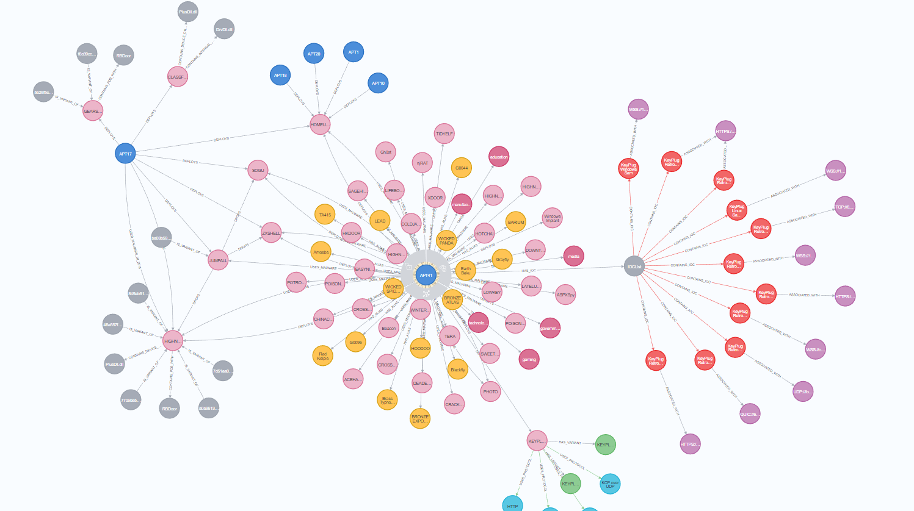
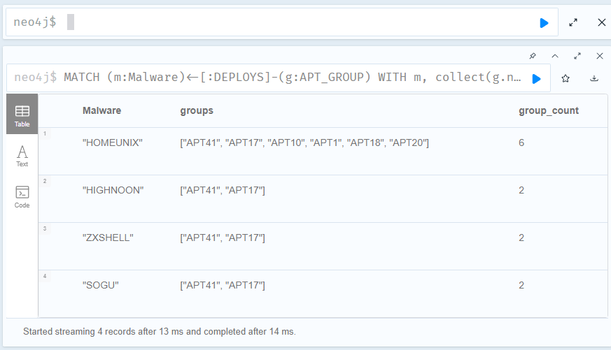
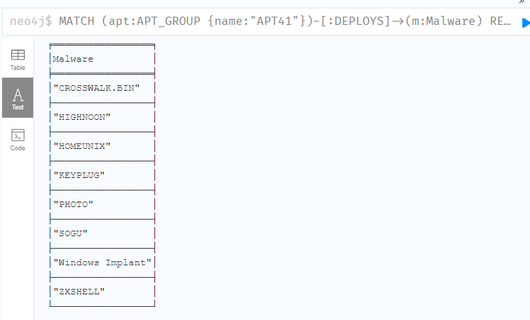
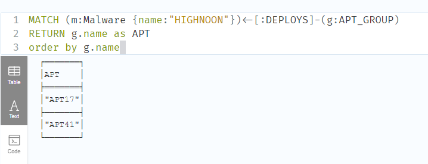
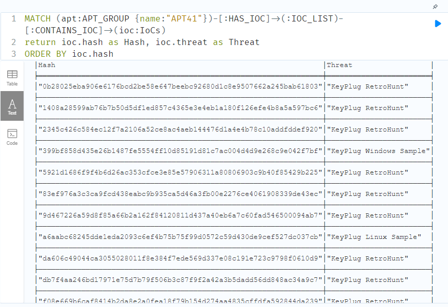
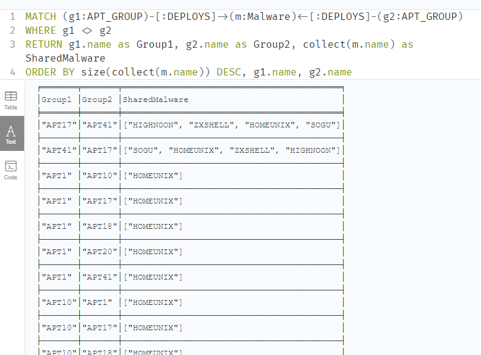
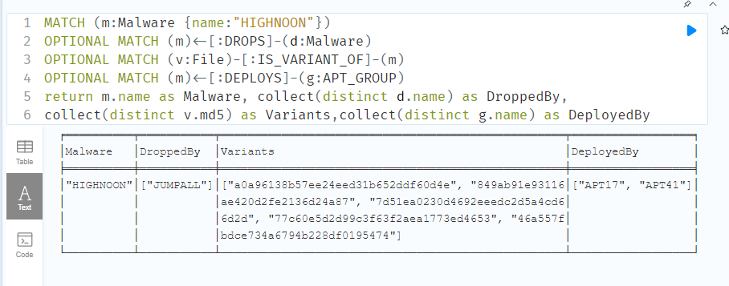
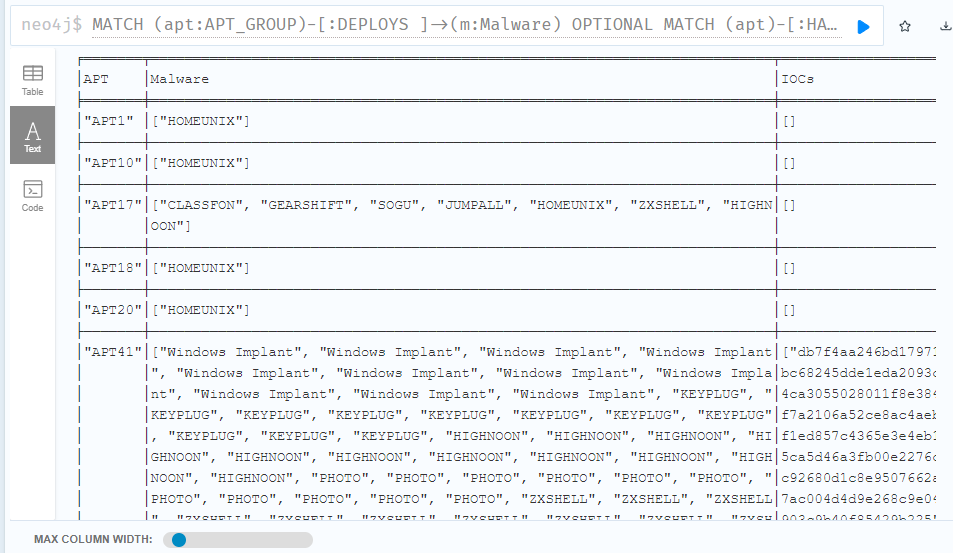

# APT41 - Knowledge Graph with Neo4J
Experimentation of Neo4J for knowledge mapping and Querying. Testing out ease of use for TI though this idea is not original

# DATA Sources
- Mandiant
  - https://www.mandiant.com/sites/default/files/2022-02/rt-apt41-dual-operation.pdf
- VirusTotal
  - https://www.virustotal.com/gui/reference/815f0686638ec516ea260507ab1b76678b2ef33bf40ef4fb279cc417fc3681fb

# Queries
Some interesting queries that we can make.

## Display the whole graph

```
MATCH (n) RETURN n
```



## SEARCHING FOR OVERLAPPING APT USING SIMILAR MALWARE

We can make use of collect to create a list of APT Group names. For each of the malware `m`, it would then count the total number of APT Groups and as long as there are more than 1 count, then we want to display the results starting from highest group count.

```
MATCH (m:Malware)<-[:DEPLOYS]-(g:APT_GROUP)
WITH m, collect(g.name) as groups, count(g) as group_count
WHERE group_count > 1
RETURN m.name as Malware, groups, group_count
ORDER BY group_count DESC
```



## Query all the malware that was deployed by specific APT

```
MATCH (apt:APT_GROUP  {name:"APT41"})-[:DEPLOYS]->(m:Malware)
RETURN m.name as Malware
ORDER BY m.name
```


## Query all apt groups using specific malware

```
MATCH (m:Malware {name:"HIGHNOON"})<-[:DEPLOYS]-(g:APT_GROUP)
RETURN g.name as APT
order by g.name
```



## Query for All IoCs (Indicators of Compromise) Associated with a Specific APT Group

```
MATCH (apt:APT_GROUP {name:"APT41"})-[:HAS_IOC]->(:IOC_LIST)-[:CONTAINS_IOC]->(ioc:IoCs)
return ioc.hash as Hash, ioc.threat as Threat
ORDER BY ioc.hash
```



## Query for shared tools between APT

As long as two different groups deploys the same malware, we want to display those results

```
MATCH (g1:APT_GROUP)-[:DEPLOYS]->(m:Malware)<-[:DEPLOYS]-(g2:APT_GROUP)
WHERE g1 <> g2
RETURN g1.name as Group1, g2.name as Group2, collect(m.name) as SharedMalware
ORDER BY size(collect(m.name)) DESC, g1.name, g2.name
```



## Query for Detailed Information on a Specific Malware Including Its Variants, Droppers, and APT Groups Using It

A more complex query which makes use of optional matching.

```
MATCH (m:Malware {name:"HIGHNOON"})
OPTIONAL MATCH (m)<-[:DROPS]-(d:Malware)
OPTIONAL MATCH (v:File)-[:IS_VARIANT_OF]-(m)
OPTIONAL MATCH (m)<-[:DEPLOYS]-(g:APT_GROUP)
return m.name as Malware, collect(distinct d.name) as DroppedBy, 
collect(distinct v.md5) as Variants,collect(distinct g.name) as DeployedBy
```



## Query for all apt groups, their associated IOCS and the malware they used

```
MATCH (apt:APT_GROUP)-[:DEPLOYS ]->(m:Malware)
OPTIONAL MATCH (apt)-[:HAS_IOC]->(:IOC_LIST)-[:CONTAINS_IOC]->(ioc:IoCs)
RETURN apt.name as APT, collect (m.name) as Malware, collect (distinct ioc.hash) as IOCs
ORDER BY apt.name
```



---

# LOOK HERE AT YOUR OWN PERIL

Below is a dump of how this graph is created. 

> THERE MIGHT BE MISSING LINES AND EXTRA ERRORNOUS STUFF BUT ITS MEANT AS REFERENCE FOR HOW THIS GRAPH MAY BE CREATED BASED ON THREAT REPORT FROM MANDIANT AND INFORMATION FROM VIRUSTOTAL
>
> On the other hand, all these could be automated a little better with GUI for graph creation but that will be for another time.

```
MERGE (apt41:APT_GROUP {name:"APT41", description:"APT41's operations stand out due to their complexity and versatility, reflecting a high level of expertise and resources, possibly indicating support or connections with state entities. The group targets a wide array of sectors including government, manufacturing, technology, media, education, and gaming, with the intent of stealing intellectual property, sensitive data, and compromising systems for strategic or economic gain.\n\nThe group's tactics, techniques, and procedures (TTPs) include the deployment of malware, phishing, exploitation of zero-day software vulnerabilities, and supply chain attacks. Their activities pose a global threat, necessitating constant vigilance from cybersecurity professionals to mitigate associated risks."})
RETURN  apt41


WITH ["Amoeba", "BARIUM", "BRONZE ATLAS", "BRONZE EXPORT", "Blackfly", "Brass Typhoon", "Earth Baku", "G0044", "G0096", "Grayfly", "HOODOO", "LEAD", "Red Kelpie", "TA415", "WICKED PANDA", "WICKED SPIDER"] AS aliases
MERGE (apt41:APT_GROUP {name: "APT41"})
FOREACH (alias IN aliases |
  MERGE (a:Alias {name: alias})
  MERGE (apt41)-[:HAS_ALIAS]->(a)
)
RETURN apt41;


WITH ["government", "manufacturing", "technology", "media", "education", "gaming"] AS sectors
MERGE (apt41:APT_GROUP {name: "APT41"})
FOREACH (sector IN sectors |
  MERGE (s:Sector {name: sector})
  MERGE (apt41)-[:TARGETS]->(s)
)
RETURN apt41;


MERGE (apt41:APT_GROUP {name: "APT41"})
MERGE (implant:Malware {name: "Windows Implant"})
SET implant.sha256 = "87756cb5e33f7fb7c2229eb094f1208dbd510c9716b4428bfaf2dc84745b1542",
    implant.threat = ".NET Loader",
    implant.threat_description = "Simple .NET Loader which decrypts and executes shellcode leading to the final KeyPlug payload",
    implant.ssdeep = "192:+3c5NTgL6xvKDgtRy5TZYxALUsLh4LSOK7kJ9POxLVLSE7pZ6A5U1A:+3cfvCMjcTZEAL9LOLSngJ5sLVL9NQUl",
    implant.target_os = "Windows",
    implant.language = ".NET",
    implant.encrypted_file = "C:\\ProgramData\\pfm.ico"
MERGE (apt41)-[:DEPLOYS]->(implant)
RETURN apt41, implant;


MERGE (apt41:APT_GROUP {name: "APT41"})
MERGE (keyplug:Malware {name: "KEYPLUG"})
SET keyplug.description = "KEYPLUG is an infamous modular backdoor malware written in C++ and active since at least June 2021. It has variants for both Windows and Linux platforms. It supports multiple network protocols for command and control (C2) traffic, including HTTP, TCP, KCP over UDP, and WSS, making it a potent tool in APT41's cyber-attack arsenal."
MERGE (apt41)-[:DEPLOYS]->(keyplug)

MERGE (windows_variant:MalwareVariant {name: "KEYPLUG Windows Variant"})
SET windows_variant.description = "The Windows variant of KEYPLUG has its own custom configuration and uses the WSS protocol for C2 communication."
MERGE (keyplug)-[:HAS_VARIANT]->(windows_variant)

MERGE (linux_variant:MalwareVariant {name: "KEYPLUG Linux Variant"})
SET linux_variant.description = "The Linux variant of KEYPLUG has its own custom configuration and uses the WSS protocol for C2 communication."
MERGE (keyplug)-[:HAS_VARIANT]->(linux_variant)

MERGE (protocol_http:Protocol {name: "HTTP"})
MERGE (protocol_tcp:Protocol {name: "TCP"})
MERGE (protocol_kcp_udp:Protocol {name: "KCP over UDP"})
MERGE (protocol_wss:Protocol {name: "WSS"})

MERGE (keyplug)-[:USES_PROTOCOL]->(protocol_http)
MERGE (keyplug)-[:USES_PROTOCOL]->(protocol_tcp)
MERGE (keyplug)-[:USES_PROTOCOL]->(protocol_kcp_udp)
MERGE (keyplug)-[:USES_PROTOCOL]->(protocol_wss)

RETURN apt41, keyplug, windows_variant, linux_variant;


MATCH (apt:APT_GROUP {name:"APT41"})-[:HAS_IOC]->(:IOC_LIST)


MATCH (apt41:APT_GROUP {name: "APT41"})
MERGE (IOCList:IOC_LIST {name: "IOCList"})
MERGE (apt41)-[XX:HAS_IOC]->(IOCList)

WITH apt41,XX,IOCList, [
  {hash: "0b28025eba906e6176bcd2be58e647beebc92680d1c8e9507662a245bab61803", threat: "KeyPlug RetroHunt", urls: ["HTTPS://45.204.1.248:55589"]},
  {hash: "1408a28599ab76b7b50d5df1ed857c4365e3e4eb1a180f126efe4b8a5a597bc6", threat: "KeyPlug RetroHunt", urls: ["QUIC://67.43.234.146:443"]},
  {hash: "2345c426c584ec12f7a2106a52ce8ac4aeb144476d1a4e4b78c10addfddef920", threat: "KeyPlug RetroHunt", urls: ["WSS://chrome.down-flash.com:443"]},
  {hash: "2c28a59408ee8322bc6522734965db8261c196bf563c28dd61d5b65f7fd9a927", threat: "DarkLoadLibrary"},
  {hash: "399bf858d435e26b1487fe5554ff10d85191d81c7ac004d4d9e268c9e042f7bf", threat: "KeyPlug Windows Sample", urls: ["WSS://104.16.85.0/24"]},
  {hash: "4496fb2e42bb8734d4d5c6c40fa6e5f7afa00233ffa1c9e4b00e1ef4fd7849ad", threat: "KeyPlug Shellcode"},
  {hash: "5921d1686f9f4b6d26ac353cfce3e85e57906311a80806903c9b40f85429b225", threat: "KeyPlug RetroHunt", urls: ["HTTPS://43.229.155.38:8443"]},
  {hash: "619c185406e6272ba8ac70ad4c6ff2174e5470011c5737c6c2198cd69d86ec95", threat: "DarkLoadLibrary"},
  {hash: "7248217c106dfa048a9e5593cba257fd5189877c490f7d365156e55880c5ddca", threat: "Shellcode Encrypted - pfm.ico"},
  {hash: "83ef976a3c3ca9fcd438eabc9b935ca5d46a3fb00e2276ce4061908339de43ec", threat: "KeyPlug RetroHunt", urls: ["UDP://fonts.google-au.ga:53"]},
  {hash: "87756cb5e33f7fb7c2229eb094f1208dbd510c9716b4428bfaf2dc84745b1542", threat: ".NET Shellcode Loader"},
  {hash: "9d467226a59d8f85a66b2a162f84120811d437a40eb6a7c60fad546500094ab7", threat: "KeyPlug RetroHunt", urls: ["WSS://104.21.82.192:443"]},
  {hash: "a6aabc68245dde1eda2093c6ef4b75b75f99d0572c59d430de9cef527dc037cb", threat: "KeyPlug Linux Sample", urls: ["WSS://172.67.249.0/24"]},
  {hash: "da606c49044ca3055028011f8e384f7ede569d337e08c191e723c9798f0610d9", threat: "KeyPlug RetroHunt", urls: ["TCP://8.210.71.245:443"]},
  {hash: "db7f4aa246bd17971e75d7b79f506b3c87f9f2a42a3b5dadd56dd848ac34a9c7", threat: "KeyPlug RetroHunt", urls: ["HTTPS://127.0.0.1:443"]},
  {hash: "e94bcaf0d01fcd2f76f1c08575c3ec6315508cdbf72684a180c6992c68b10cc3", threat: "DarkLoadLibrary"},
  {hash: "f08e669b6caf8414b2da8e2a0fea18f79b154d274aa4835cffdfa592844da239", threat: "KeyPlug RetroHunt", urls: ["HTTPS://127.0.0.1:443"]}
] AS iocs

UNWIND iocs AS ioc
MERGE (ioc_node:IoCs {hash: ioc.hash, threat: ioc.threat})

FOREACH (url IN CASE WHEN ioc.urls IS NOT NULL THEN ioc.urls ELSE [] END |
  MERGE (indicator:Indicator {url: url})
  MERGE (ioc_node)-[:ASSOCIATED_WITH]->(indicator)
  MERGE (IOCList)-[:CONTAINS_IOC]->(ioc_node)
)


MERGE (highnoon:Malware {name: "HIGHNOON"})
MERGE (homeunix:Malware {name: "HOMEUNIX"})
MERGE (photo:Malware {name: "PHOTO"})
MERGE (sogu:Malware {name: "SOGU"})
MERGE (zxshell:Malware {name: "ZXSHELL"})

with highnoon, homeunix, photo, sogu, zxshell
MATCH (apt41:APT_GROUP {name: "APT41"})

MERGE (apt41)-[:DEPLOYS]->(highnoon)
MERGE (apt41)-[:DEPLOYS]->(homeunix)
MERGE (apt41)-[:DEPLOYS]->(photo)
MERGE (apt41)-[:DEPLOYS]->(sogu)
MERGE (apt41)-[:DEPLOYS]->(zxshell)


MATCH (highnoon:Malware {name:"HIGHNOON"})
MATCH (highnoon:Malware {name:"HOMEUNIX"})
MATCH (highnoon:Malware {name:"PHOTO"})
MATCH (highnoon:Malware {name:"SOGU"})
MATCH (highnoon:Malware {name:"ZXSHELL"})
MERGE (jumpall:Malware {name:"JUMPALL", descriptiopn:"A dropper for Highnoon, zxshell, sogu used by APT17 and APT41",reference:"https://www.mandiant.com/sites/default/files/2022-02/rt-apt41-dual-operation.pdf"})

MERGE (apt17:APT_GROUP {name:"APT17"})
MERGE (apt10:APT_GROUP {name:"APT10"})
MERGE (apt1:APT_GROUP {name:"APT1"})
MERGE (apt18:APT_GROUP {name:"APT18"})
MERGE (apt20:APT_GROUP {name:"APT20"})

MERGE (apt1)-[:DEPLOYS]->(homeunix)
MERGE (apt10)-[:DEPLOYS]->(homeunix)
MERGE (apt17)-[:DEPLOYS]->(homeunix)
MERGE (apt18)-[:DEPLOYS]->(homeunix)
MERGE (apt20)-[:DEPLOYS]->(homeunix)

MERGE (apt17)-[:DEPLOYS]->(highnoon)
MERGE (apt17)-[:DEPLOYS]->(zxshell)
MERGE (apt17)-[:DEPLOYS]->(sogu)
MERGE (apt17)-[:DEPLOYS]->(jumpall)

MERGE (jumpall)-[:DROPS]->(highnoon)
MERGE (jumpall)-[:DROPS]->(zxshell)
MERGE (jumpall)-[:DROPS]->(sogu)


MERGE (apt41:APT_GROUP {name: "APT41"})
MERGE (highnoon:Malware {name: "HIGHNOON"})
MERGE (highnoon_bin:Malware {name: "HIGHNOON.BIN"})
MERGE (homeunix:Malware {name: "HOMEUNIX"})
MERGE (photo:Malware {name: "PHOTO"})
MERGE (sogu:Malware {name: "SOGU"})
MERGE (zxshell:Malware {name: "ZXSHELL"})
MERGE (jumpall:Malware {name: "JUMPALL"})
MERGE (crosswalk_bin:Malware {name: "CROSSWALK.BIN"})
MERGE (classfon:Malware {name: "CLASSFON"})
MERGE (highnoon_cli:Malware {name: "HIGHNOON.CLI"})
MERGE (gearshift:Malware {name: "GEARSHIFT"})
MERGE (asp:Malware {name: "ASPXSpy"})
MERGE (acehash:Malware {name: "ACEHASH"})
MERGE (beacon:Malware {name: "Beacon"})
MERGE (chinachop:Malware {name: "CHINACHOP"})
MERGE (coldjava:Malware {name: "COLDJAVA"})
MERGE (crackshot:Malware {name: "CRACKSHOT"})
MERGE (crosswalk:Malware {name: "CROSSWALK"})
MERGE (deadeye:Malware {name: "DEADEYE"})
MERGE (downtime:Malware {name: "DOWNTIME"})
MERGE (easynight:Malware {name: "EASYNIGHT"})
MERGE (gh0st:Malware {name: "Gh0st"})
MERGE (highnoon_lite:Malware {name: "HIGHNOON.LITE"})
MERGE (highnoon_pasteboy:Malware {name: "HIGHNOON.PASTEBOY"})
MERGE (hotchai:Malware {name: "HOTCHAI"})
MERGE (hkdoor:Malware {name: "HKDOOR"})
MERGE (latelunch:Malware {name: "LATELUNCH"})
MERGE (lifeboat:Malware {name: "LIFEBOAT"})
MERGE (lowkey:Malware {name: "LOWKEY"})
MERGE (njrat:Malware {name: "njRAT"})
MERGE (poisonplug:Malware {name: "POISONPLUG"})
MERGE (poisonplug_shadow:Malware {name: "POISONPLUG.SHADOW"})
MERGE (potroast:Malware {name: "POTROAST"})
MERGE (sagehire:Malware {name: "SAGEHIRE"})
MERGE (sweetcandle:Malware {name: "SWEETCANDLE"})
MERGE (tera:Malware {name: "TERA"})
MERGE (tidyelf:Malware {name: "TIDYELF"})
MERGE (xdoor:Malware {name: "XDOOR"})
MERGE (winterlove:Malware {name: "WINTERLOVE"})

// Create relationship between APT41 and malware families
MERGE (apt41)-[:USES_MALWARE]->(highnoon)
MERGE (apt41)-[:USES_MALWARE]->(highnoon_bin)
MERGE (apt41)-[:USES_MALWARE]->(homeunix)
MERGE (apt41)-[:USES_MALWARE]->(photo)
MERGE (apt41)-[:USES_MALWARE]->(sogu)
MERGE (apt41)-[:USES_MALWARE]->(zxshell)
MERGE (apt41)-[:USES_MALWARE]->(jumpall)
MERGE (apt41)-[:USES_MALWARE]->(crosswalk_bin)
MERGE (apt41)-[:USES_MALWARE]->(asp)
MERGE (apt41)-[:USES_MALWARE]->(acehash)
MERGE (apt41)-[:USES_MALWARE]->(beacon)
MERGE (apt41)-[:USES_MALWARE]->(chinachop)
MERGE (apt41)-[:USES_MALWARE]->(coldjava)
MERGE (apt41)-[:USES_MALWARE]->(crackshot)
MERGE (apt41)-[:USES_MALWARE]->(crosswalk)
MERGE (apt41)-[:USES_MALWARE]->(deadeye)
MERGE (apt41)-[:USES_MALWARE]->(downtime)
MERGE (apt41)-[:USES_MALWARE]->(easynight)
MERGE (apt41)-[:USES_MALWARE]->(gh0st)
MERGE (apt41)-[:USES_MALWARE]->(highnoon_lite)
MERGE (apt41)-[:USES_MALWARE]->(highnoon_pasteboy)
MERGE (apt41)-[:USES_MALWARE]->(hotchai)
MERGE (apt41)-[:USES_MALWARE]->(hkdoor)
MERGE (apt41)-[:USES_MALWARE]->(latelunch)
MERGE (apt41)-[:USES_MALWARE]->(lifeboat)
MERGE (apt41)-[:USES_MALWARE]->(lowkey)
MERGE (apt41)-[:USES_MALWARE]->(njrat)
MERGE (apt41)-[:USES_MALWARE]->(poisonplug)
MERGE (apt41)-[:USES_MALWARE]->(poisonplug_shadow)
MERGE (apt41)-[:USES_MALWARE]->(potroast)
MERGE (apt41)-[:USES_MALWARE]->(sagehire)
MERGE (apt41)-[:USES_MALWARE]->(sweetcandle)
MERGE (apt41)-[:USES_MALWARE]->(tera)
MERGE (apt41)-[:USES_MALWARE]->(tidyelf)
MERGE (apt41)-[:USES_MALWARE]->(xdoor)
MERGE (apt41)-[:USES_MALWARE]->(winterlove)


MERGE (apt41:APT_GROUP {name:"APT41"})
MERGE  (highnoon:Malware {name:"HIGHNOON"})
MERGE (homeunix:Malware {name:"HOMEUNIX"})
MERGE (photo:Malware {name:"PHOTO"})
MERGE (sogu:Malware {name:"SOGU"})
MERGE (zxshell:Malware {name:"ZXSHELL"})
MERGE (crosswalk_bin:Malware {name: "CROSSWALK.BIN"})
MERGE (classfon:Malware {name:"CLASSFON"})
MERGE (gearshift:Malware {name:"GEARSHIFT"})
MERGE (jumpall:Malware {name:"JUMPALL", descriptiopn:"A dropper for Highnoon, zxshell, sogu used by APT17 and APT41",reference:"https://www.mandiant.com/sites/default/files/2022-02/rt-apt41-dual-operation.pdf"})

MERGE (apt41)-[:DEPLOYS]->(crosswalk_bin)
MERGE (apt17:APT_GROUP {name:"APT17"})
MERGE (apt10:APT_GROUP {name:"APT10"})
MERGE (apt1:APT_GROUP {name:"APT1"})
MERGE (apt18:APT_GROUP {name:"APT18"})
MERGE (apt20:APT_GROUP {name:"APT20"})

MERGE (apt1)-[:DEPLOYS]->(homeunix)
MERGE (apt10)-[:DEPLOYS]->(homeunix)
MERGE (apt17)-[:DEPLOYS]->(homeunix)
MERGE (apt18)-[:DEPLOYS]->(homeunix)
MERGE (apt20)-[:DEPLOYS]->(homeunix)

MERGE (apt17)-[:USED_MALWARE_IN_2015]->(highnoon)
MERGE (apt17)-[:DEPLOYS]->(highnoon)
MERGE (apt17)-[:DEPLOYS]->(zxshell)
MERGE (apt17)-[:DEPLOYS]->(sogu)
MERGE (apt17)-[:DEPLOYS]->(jumpall)
MERGE (apt17)-[:DEPLOYS]->(classfon)
MERGE (apt17)-[:DEPLOYS]->(gearshift)

MERGE (classfon)-[:CONTAINS_INTERNAL_NAME]->(:InternalName {name: "DrvDll.dll"})
MERGE (classfon)-[:CONTAINS_DEVICE_DRIVER]->(:DeviceDriver {name: "PlusDll.dll"})
MERGE (highnoon)-[:CONTAINS_DEVICE_DRIVER]->(:DeviceDriver {name: "PlusDll.dll"})

MERGE (jumpall)-[:DROPS]->(highnoon)
MERGE (jumpall)-[:DROPS]->(zxshell)
MERGE (jumpall)-[:DROPS]->(sogu)

MERGE (highnoon)-[:CONTAINS_PDB_PATH]->(:PDBPath {name: "RBDoor"})
MERGE (gearshift)-[:CONTAINS_PDB_PATH]->(:PDBPath {name: "RBDoor"})

MERGE (file1:File {md5: "46a557fbdce734a6794b228df0195474"})-[:IS_VARIANT_OF]->(highnoon)
MERGE (file2:File {md5: "77c60e5d2d99c3f63f2aea1773ed4653"})-[:IS_VARIANT_OF]->(highnoon)
MERGE (file3:File {md5: "a0a96138b57ee24eed31b652ddf60d4e"})-[:IS_VARIANT_OF]->(highnoon)
MERGE (file4:File {md5: "7d51ea0230d4692eeedc2d5a4cd66d2d"})-[:IS_VARIANT_OF]->(highnoon)
MERGE (file5:File {md5: "849ab91e93116ae420d2fe2136d24a87"})-[:IS_VARIANT_OF]->(highnoon)
MERGE (file6:File {md5: "ba08b593250c3ca5c13f56e2ca97d85e"})-[:IS_VARIANT_OF]->(jumpall)
MERGE (file7:File {md5: "f8c89ccd8937f2b760e6706738210744"})-[:IS_VARIANT_OF]->(gearshift)
MERGE (file8:File {md5: "5b26f5c7c367d5e976aaba320965cc7f"})-[:IS_VARIANT_OF]->(gearshift)


```
